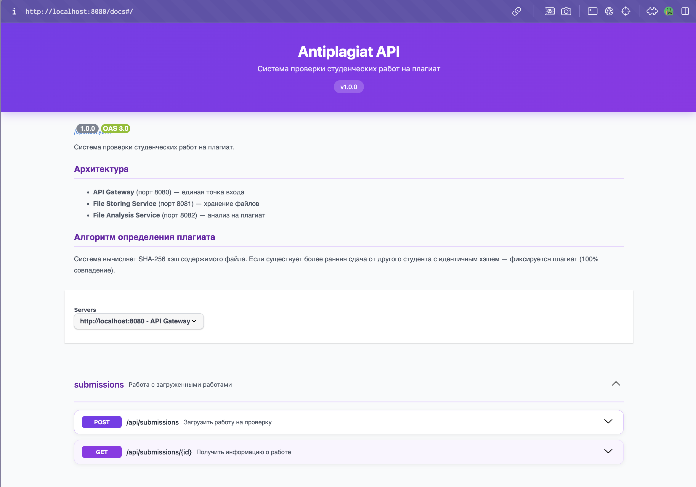
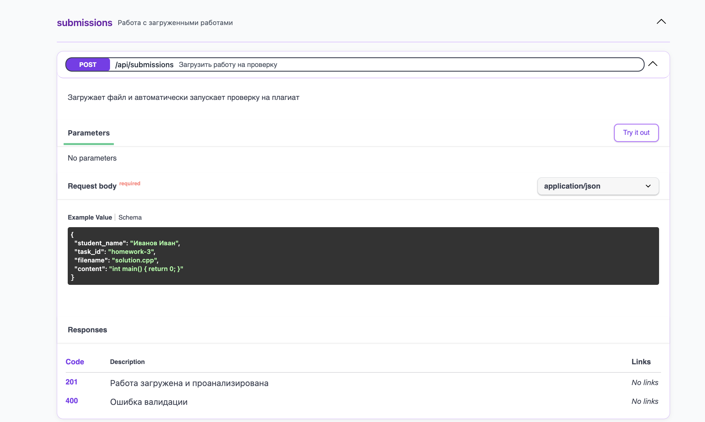
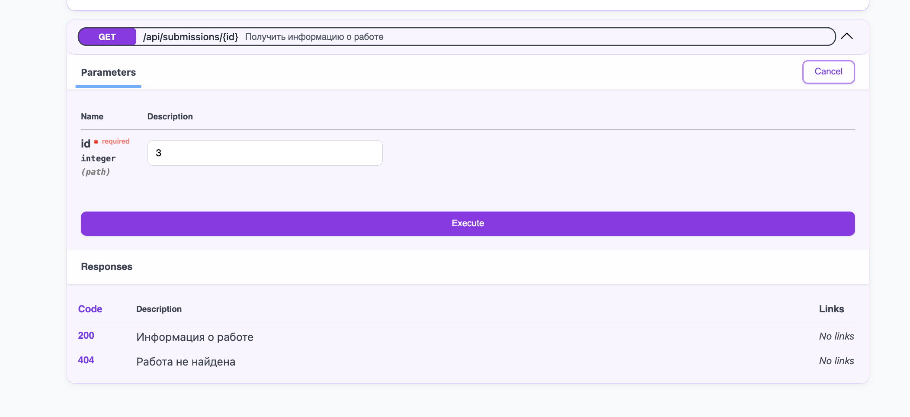
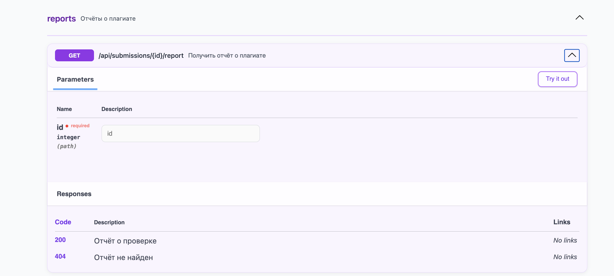
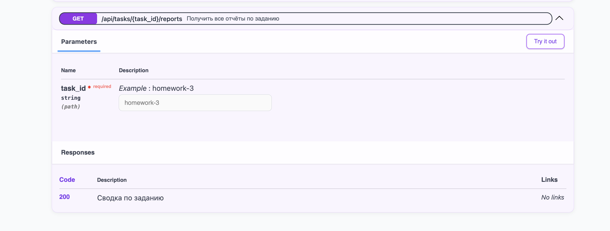
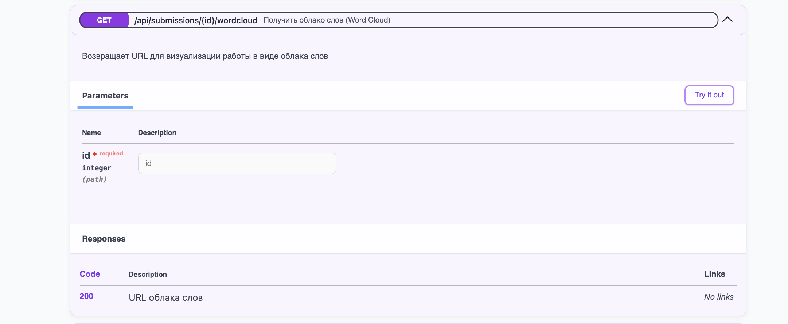
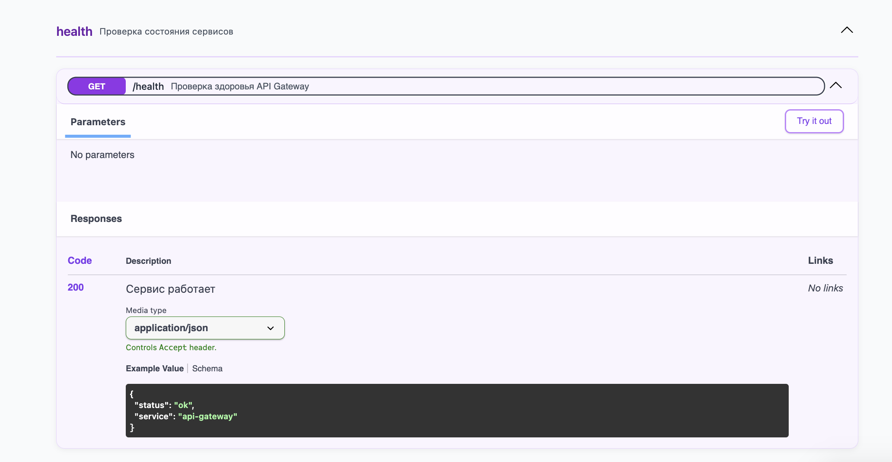
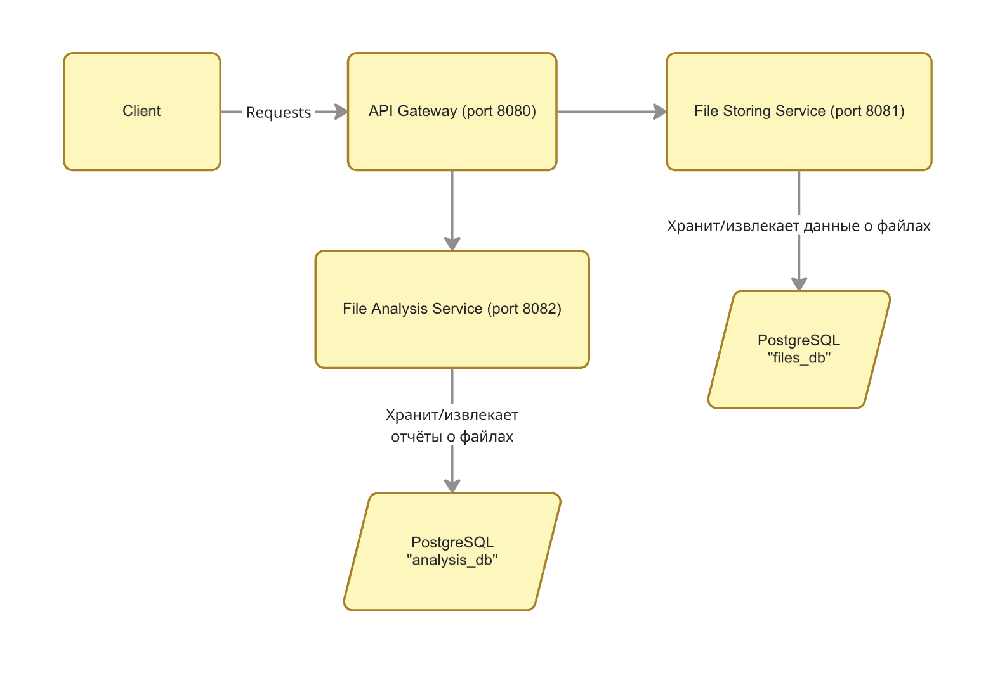

# Antiplagiat-App

Система проверки студенческих работ на плагиат.

Домашнее задание 3 по курсу "Конструирование программного обеспечения"


## Описание проекта

Antiplagiat-App — это веб-сервис, который принимает студенческие работы и проверяет их на списывание. Студент отправляет файл с кодом, система сохраняет его и сразу проверяет, не сдавал ли кто-то такой же файл раньше. Преподаватель может посмотреть отчёты по любому заданию и увидеть, кто у кого списал.

Система состоит из трёх микросервисов, каждый из которых отвечает за свою часть работы. Все сервисы упакованы в Docker-контейнеры и запускаются одной командой.

---

## Быстрый старт

Для запуска нужен только Docker. Клонируйте репозиторий и выполните:

```bash
docker-compose up --build -d
```

После запуска откройте в браузере:

```
http://localhost:8080/docs
```

Здесь находится интерактивная документация API, через которую можно тестировать все функции системы.



---

## Как пользоваться

### Загрузка работы на проверку

Чтобы отправить работу на проверку, используется эндпоинт `POST /api/submissions`. В теле запроса нужно передать JSON с информацией о студенте, задании и содержимым файла.

Важная особенность: содержимое файла передаётся как текст в поле `content`. Это не путь к файлу и не base64, а именно текстовое содержимое. Если в коде есть переносы строк, их нужно экранировать как `\n`.



Пример запроса:

```json
{
  "student_name": "Иванов Иван",
  "task_id": "homework-3",
  "filename": "solution.cpp",
  "content": "#include <iostream>\n\nint main() {\n    return 0;\n}"
}
```

После отправки система сохраняет файл и сразу запускает проверку на плагиат. В ответе приходит информация о загруженном файле и результат анализа:

```json
{
  "submission": {
    "id": 1,
    "student_name": "Иванов Иван",
    "task_id": "homework-3",
    "filename": "solution.cpp",
    "file_hash": "a1b2c3d4...",
    "file_size": 45
  },
  "analysis": {
    "is_plagiarism": false,
    "similarity_percent": 0,
    "original_submission_id": null
  }
}
```

Если теперь другой студент отправит файл с таким же содержимым, система обнаружит плагиат:

```json
{
  "analysis": {
    "is_plagiarism": true,
    "similarity_percent": 100,
    "original_submission_id": 1
  }
}
```

### Получение информации о работе

Эндпоинт `GET /api/submissions/{id}` возвращает информацию о конкретной загруженной работе.



### Получение отчёта о плагиате

Эндпоинт `GET /api/submissions/{id}/report` возвращает подробный отчёт о проверке на плагиат для конкретной работы.



### Сводка по заданию

Можно получить общую картину по заданию через `GET /api/tasks/{task_id}/reports`. В ответе приходит список всех работ по этому заданию с указанием, какие из них являются плагиатом.



Пример ответа:

```json
{
  "task_id": "homework-3",
  "total_submissions": 5,
  "plagiarism_count": 2,
  "reports": [
    {
      "submission_id": 1,
      "student_name": "Иванов Иван",
      "is_plagiarism": false
    },
    {
      "submission_id": 2,
      "student_name": "Петров Пётр",
      "is_plagiarism": true,
      "original_submission_id": 1
    }
  ]
}
```

### Облако слов (Word Cloud)

Для визуализации содержимого работы можно получить облако слов через `GET /api/submissions/{id}/wordcloud`. В ответе приходит ссылка на сервис QuickChart, которую нужно открыть в браузере.



### Проверка состояния сервиса

Эндпоинт `GET /health` позволяет проверить, что сервис работает.



---

## Архитектура

Система построена на микросервисной архитектуре и состоит из трёх компонентов:



**API Gateway** — принимает все запросы от клиентов и направляет их нужным сервисам. При загрузке файла сначала отправляет его в File Storing Service, затем запускает анализ в File Analysis Service и возвращает объединённый результат.

**File Storing Service** — сохраняет файлы на диск, вычисляет SHA-256 хеш содержимого и хранит метаданные в базе данных. Умеет искать файлы по хешу, что используется для обнаружения дубликатов.

**File Analysis Service** — проверяет работы на плагиат и формирует отчёты. Обращается к File Storing Service для поиска файлов с одинаковым хешем.

---

## Алгоритм определения плагиата

Система использует простой, но надёжный алгоритм на основе криптографических хешей.

При загрузке каждого файла вычисляется его SHA-256 хеш. Это "отпечаток" содержимого файла: если два файла имеют одинаковое содержимое, их хеши будут идентичны. При этом вероятность случайного совпадения хешей разных файлов практически равна нулю.

Когда приходит новая работа, система ищет в базе файлы с таким же хешем. Если находит файл, загруженный ранее другим студентом в рамках того же задания — фиксирует плагиат со 100% совпадением.

Логика проверки:

```
1. Вычислить hash = SHA256(содержимое файла)
2. Найти в базе все файлы с таким же hash
3. Среди найденных отфильтровать:
   - тот же task_id (то же задание)
   - другой student_name (другой студент)
   - более ранняя дата загрузки
4. Если такой файл найден — это плагиат
```

Ограничения алгоритма: он обнаруживает только полное копирование. Если студент изменит хотя бы один символ, хеш будет другим и плагиат не обнаружится.

---

## Обработка ошибок

Если один из внутренних сервисов недоступен, система не падает, а возвращает частичный результат. Например, если File Analysis Service не отвечает, файл всё равно сохранится, а в ответе будет предупреждение:

```json
{
  "submission": { ... },
  "analysis": null,
  "warning": "File uploaded but analysis service unavailable"
}
```

HTTP код ответа в таком случае — 207 (Multi-Status).

---

## Структура проекта

```
antiplagiat/
├── docker-compose.yml          # Конфигурация контейнеров
├── CMakeLists.txt
├── README.md
├── libs/                       # Внешние библиотеки (httplib, json)
├── init-scripts/               # SQL скрипты инициализации БД
├── docs/
│   └── images/                 # Скриншоты для документации
├── api-gateway/
│   ├── Dockerfile
│   └── src/
│       ├── main.cpp
│       ├── config/
│       ├── clients/
│       └── handlers/
├── file-storing-service/
│   ├── Dockerfile
│   └── src/
│       ├── main.cpp
│       ├── config/
│       ├── db/
│       ├── models/
│       ├── repository/
│       ├── service/
│       ├── handlers/
│       └── utils/
└── file-analysis-service/
    ├── Dockerfile
    └── src/
        ├── main.cpp
        ├── config/
        ├── db/
        ├── models/
        ├── repository/
        ├── clients/
        ├── service/
        └── handlers/
```

Каждый сервис имеет слоистую архитектуру: handlers (HTTP) -> service (бизнес-логика) -> repository (работа с БД).

---

## Технологии

- C++17
- cpp-httplib (HTTP сервер)
- nlohmann/json (работа с JSON)
- PostgreSQL 15
- libpqxx (драйвер PostgreSQL)
- OpenSSL (SHA-256)
- Docker, docker-compose
- QuickChart API (Word Cloud)

---

## Полезные команды

Запуск:

```bash
docker-compose up --build -d
```

Остановка:

```bash
docker-compose down
```

Полная очистка (включая базы данных):

```bash
docker-compose down -v
```

Просмотр логов:

```bash
docker-compose logs -f
```

Подключение к базе данных:

```bash
docker exec -it anitplagiat_app-files-db-1 psql -U postgres -d files_db
docker exec -it anitplagiat_app-analysis-db-1 psql -U postgres -d analysis_db
```

---

## API эндпоинты


| Метод | Путь                        | Описание                                         |
| ---------- | ------------------------------- | -------------------------------------------------------- |
| POST       | /api/submissions                | Загрузить работу на проверку    |
| GET        | /api/submissions/{id}           | Получить информацию о работе    |
| GET        | /api/submissions/{id}/report    | Получить отчёт о плагиате          |
| GET        | /api/submissions/{id}/wordcloud | Получить URL облака слов               |
| GET        | /api/tasks/{task_id}/reports    | Получить все отчёты по заданию |
| GET        | /health                         | Проверка состояния сервиса       |
| GET        | /docs                           | Swagger UI документация                      |
